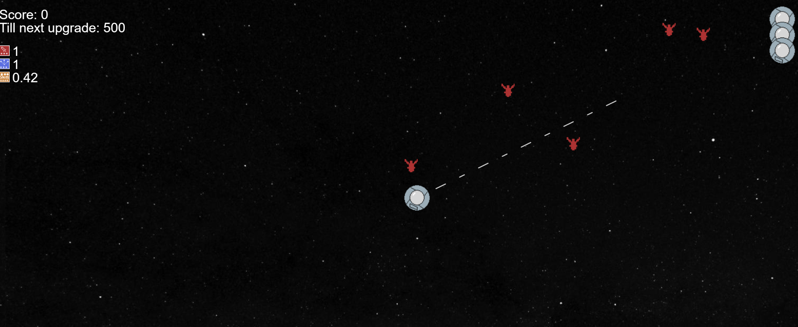
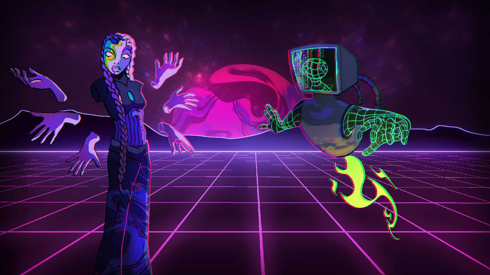
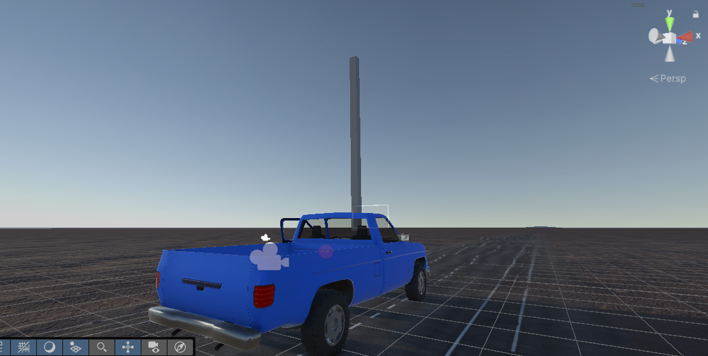

   Riley Boekestijn, Game developer     

Riley Boekestijn | Game dev and designer

*   [Home](./index.html)
*   [About](./index.html#about)
*   [Projects](./index.html#projects)
*   [Contact](./index.html#contact)

 

*   [Home](./index.html)
*   [About](./index.html#about)
*   [Projects](./index.html#projects)
*   [Contact](./index.html#contact)

# Hey, My name is Riley Boekestijn

I'm a passionate game developer and designer. What i lack in knowledge, i make up for in enthousiasm and a willingness to learn!

[Projects](#projects)

## About Me I'm an enthousiastic gamer, from a young age i knew this is what i wanted to do with my life. Ever since i've been tinkering, starting in gamemaker studio and moving on from there. On the side, i enjoy boardgames, particularly i play a lot of Dungeons and Dragons. Beyond that, i also enjoy airsoft, and am a bit of military nerd.

### Get to know me!

Hey! It's **Riley Boekestijn** and I'm a **Game developer and designer** located in the netherlands. I'm in the middle of earning my bachelors degree right now, and hope to be entering the field in a couple years!

contact me here.

[Contact](#contact)

### My Skills

HTML

CSS

JavaScript

GIT

C#

C++

Unity

Unreal Engine

Godot

## Projects A list of my projects, both for university as for my own personal enjoyment!

### Alien Abductors

A bullet heaven built without a game engine in javascript. Endlessly scaling, plenty of upgrades. How long will you survive?

[Case Study](./project-1.html)

### Vaporshot

Another project made for university, this time, the goal was to make a bullet heaven in monogame. In the end, it ended up pretty good!

[Case Study](./project-2.html)

### Hertzfarer

A prototype built in my free time. Intended to eventually be a horror game based around driving a car. Still in early development

[Prototype](./project-3.html)

## Contact Should you wish to contact me for any reason. Do it here! I'll be in touch as soon as possible! Phone: 0614700878 Email: ricardoboekestijn@gmail.com

## Social

 

[

#### Riley Boekestijn

](https://github.com/Ricco5573)

[© Copyright 2021. Made by](https://github.com/Ricco5573) [Ram Maheshwari](https://rammaheshwari.com)